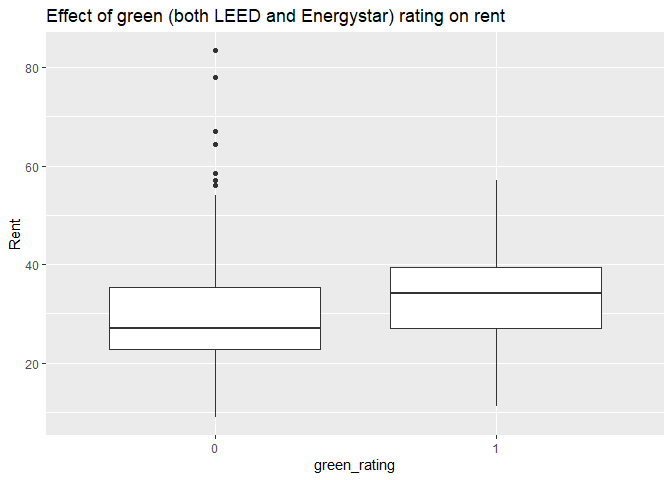
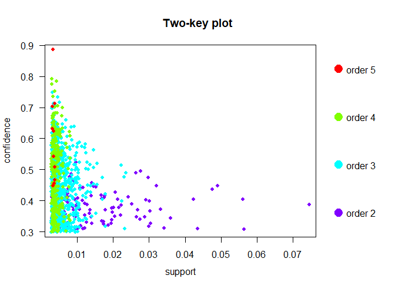

## Group members: Junhong Xu, Yeong-in Jang, Qingzi Zeng, Danyang Zhang

# 1. Green Buildings
------------------

    rm(list = ls())
    library(ggplot2)
    library(tidyverse)
    library(dplyr)
    raw_data = read_csv('./data/greenbuildings.csv')

### Step 1: The Ecosystem

We want to start with finding a list of building clusters with similar
ecosystem to our building. We can do this by finidng building clusters
that have similar weather and economy to Austin. Below are some
information on Austin’s climate and job growth rate.

Austin job growth rate: ~3% in 2008

Austin average annual precipitation: 35.9 (source: weather.gov)

Average annual CDD in Austin: 3428 (source: weather.gov)

Average annual HDD in Austin: 1413 (source: weather.gov)

Variables of interest in this step: cd.total, hd.total, precipitation,
empl.gr

    hist(raw_data$hd_total07)

    d1 = raw_data %>%
      filter(hd_total07 <= 2000)

Looking at the histrogram for heating degree days (HDD), we can see that
many of the buildings have high HDD, which indicates that the building
clusters may locate in cities that have cold winters. Buildings in cold
climates generally have very different costs associated with buildings
in warmer climates. Building construction costs are higher due to the
necesscity of insulation layers, energy consumption and utitlity costs
can also be different too. For this reason, we do not think a building
in colder climate such as Chicago, is comparable to a building in
Austin. We will filter out the buildind clusters that have annual HDD
greater than 2000. (the filtered dataset is called “d1”)

    hist(d1$empl_gr)

    d2 = d1 %>%
      filter(empl_gr > 1 & empl_gr <=10)

    hist(d2$empl_gr)

From the above histogram we see some abnormal job growth rates such
(greater than 60% & -20%). We decide to filter the building clusters out
from the data. And since we know that Austin has always enjoyed a steady
annual job growth rate of about 3% from 2007-2019, we also exclude
building clusters that have less than 1% job growth rate. The new
dataset is called “d2”.

### Step 2: The Building

We want to find buildings in the building clusters that are similar to
the building we want to build.

What we know about our building:

1.  It’s a new building
2.  It has 15 floors
3.  It’s a mixed use building
4.  It’s on Cesar Chavez, on the other side of I-35 across from downtown
5.  It’s going to be 250,000 square feet

Variables of interest in this step: size, age, stories, renovated

    ggplot(data = d2) + 
      geom_point(mapping = aes(x = stories, y = Rent))+
      labs(title="Rent vs. stories")

    ggplot(data = d2) + 
      geom_point(mapping = aes(x = size, y = Rent))+
      labs(title="Rent vs. size")

    d2$renovated = as.factor(d2$renovated)

    ggplot(data = d2) + 
      geom_point(mapping = aes(x = age, y = Rent, color = renovated))+
      labs(title="Rent vs. age")

From the above graphs we see that there are still a lot of building left
in our dataset, and we don’t see a clear pattern.

    d3 = d2 %>%
      filter(stories <= 20 & stories >= 10 & size > 100000 & size < 300000)

    ggplot(data = d3) + 
      geom_point(mapping = aes(x = stories, y = Rent))+
      labs(title="Rent vs. stories")

    ggplot(data = d3) + 
      geom_point(mapping = aes(x = size, y = Rent)) +
      labs(title="Rent vs. size")

    d3$green_rating = as.factor(d3$green_rating)

    ggplot(data = d3) + 
      geom_point(mapping = aes(x = age, y = Rent, color = green_rating)) +
      labs(title="Rent vs. age")

To find buildings that are similar to the one we are about to build, we
limit the square foot size of the building to be between 100,000 and
300,000. And we further filter our the building that are too tall
(&gt;20 stories) and too short (&lt;10 stories). The last graph shows
that older buildings are more likely to not be green certified building.
We don’t see any other obvious patterns between rent and stories or
size.

### Step 3: Green or no green?

Should we build a green building or not?

Variables of interest in this step: green\_rating, LEED, Energystar

    d3$green_rating = as.factor(d3$green_rating)
    d3$LEED = as.factor(d3$LEED)
    d3$Energystar = as.factor(d3$Energystar)

    ggplot(data = d3) + 
      geom_boxplot(mapping = aes(x = green_rating, y = Rent))+
      labs(title="Effect of green (both LEED and Energystar) rating on rent")

    d3 %>%
      group_by(green_rating) %>%
      summarise(median(Rent))

    ## # A tibble: 2 x 2
    ##   green_rating `median(Rent)`
    ##   <fct>                 <dbl>
    ## 1 0                      27  
    ## 2 1                      34.1

    d3 %>%
      group_by(green_rating) %>%
      summarise(mean(Rent))

    ## # A tibble: 2 x 2
    ##   green_rating `mean(Rent)`
    ##   <fct>               <dbl>
    ## 1 0                    30.1
    ## 2 1                    33.6

    ggplot(data = d3) + 
      geom_boxplot(mapping = aes(x = green_rating, y = leasing_rate))+
      labs(title="Effect of green (both LEED and Energystar) rating on leasing_rate")

    d3 %>%
      group_by(green_rating) %>%
      summarise(median(leasing_rate))

    ## # A tibble: 2 x 2
    ##   green_rating `median(leasing_rate)`
    ##   <fct>                         <dbl>
    ## 1 0                              89.3
    ## 2 1                              94.1

    d3 %>%
      group_by(green_rating) %>%
      summarise(mean(leasing_rate))

    ## # A tibble: 2 x 2
    ##   green_rating `mean(leasing_rate)`
    ##   <fct>                       <dbl>
    ## 1 0                            84.5
    ## 2 1                            90.7

The rent for green building is slightly higher on average (30.1
vs. 33.6) than non-green certifified buildings. The green buildings also
have a higher leasing rate at 91% than non-green (85%). When looking at
the median, the difference between green and non-green building become
more significant. The median rent for green building is 7 dollars more
than non-green building. And the median leasing rate for green building
is almost 5% more than non-green building.

    ggplot(data = d3) + 
      geom_point(mapping = aes(x = leasing_rate, y = Rent, color = green_rating)) +
      labs(title="Leasing rate vs. Rent (Left: No Net contract, Right: Net contract)") + facet_grid(. ~ net)

In the above graph we explore the effect of whether or not having a net
contract would affect the rent and leasing rate. There is no obvious
pattern but we find that there are only five buildings in our filtered
dataset that do net contracts.

### Step 4: Financial Consideration

Cost and expected return:

1.  The building has a baseline construction cost of $100 million
2.  There is a 5% expected premium for the green certification

<!-- -->

    hist(d3$Rent)

    hist(d3$leasing_rate)

We agree with the stats guru’s argument that median is more robust than
mean becasue it deals better with outliers. So, based on our previous
analysis, the median market rent for green building is $7 more than
non-green building. This would give us $250,000 x 7 = $1,750,000 of
extra revenue per year if we build the green building.

Keeping the construction costs the same at $100 million with a 5%
expected premium for green certification, our extra cost will be
recovered in $5,000,000/1,750,000 = 2.86 years (35 months). If we assume
a leasing rate of 90% (average leasing rate in our filtered dataset for
green buildings), the extra cost will still be covered in 39 months.

In conclusion, we support the stat guru’s suggestion that it is a good
financial move to build the green building. And our estiamte shows that
we will recuperate the cost of green certification much faster than the
original calcualtion.

# 2. Flights at ABIA
------------------

    abia = read_csv('data/ABIA.csv')
    abia = abia[,-1]
    abia$ElapsedDelay = abia$CRSElapsedTime - abia$ActualElapsedTime
    abia$TotalDelay = abia$ElapsedDelay + abia$ArrDelay + abia$DepDelay
    abia$depart = ifelse(abia$Origin=='AUS','Depart','Arrival')
    abia$early = ifelse(abia$TotalDelay<0,abia$TotalDelay,0)
    abia$delayed = ifelse(abia$TotalDelay>0,1,0)
    abia$Week = ifelse(abia$DayOfWeek<5,"Weekday","Weekend")

### 1) Delay by Airways

    prop = xtabs(~delayed + UniqueCarrier, data=abia) %>%
      prop.table(margin=2)
    prop = as.data.frame(prop)
    prop = prop[prop$delayed==1,]
    prop$UniqueCarrier <- factor(prop$UniqueCarrier, levels = prop$UniqueCarrier[order(-prop$Freq)])
    ggplot(prop, aes(x=UniqueCarrier,y=Freq))+
      geom_bar(stat="identity", fill="#FF9999", colour="black")+
      geom_text(aes(label=round(Freq,2)), vjust=1.6, color="black",size=3.5)+
      ylab("Proportion of delayed flight")

Atlantic Southeast Airlines(EV) has the highest delay rate with 53%
followed by Southwest Airlines(WN) with 52%. US Airways(US) has the
lowest delay rate with 22%.

    prop2 = xtabs(TotalDelay~UniqueCarrier , aggregate(TotalDelay~UniqueCarrier,abia,mean))
    prop2 = as.data.frame(prop2)
    prop2$UniqueCarrier <- factor(prop2$UniqueCarrier, levels = prop2$UniqueCarrier[order(-prop2$Freq)])
    ggplot(prop2, aes(x=UniqueCarrier,y=Freq))+
      geom_bar(stat="identity", fill="#009999", colour="black")+
      geom_text(aes(label=round(Freq,2)), vjust=1.6, color="black",size=3.5)+
      ylab("Average delayed time")

Atlantic Southeast Airlines(EV) has also the highest average delay time
with 33 minutes followed by Comair(oh) Airlines with 25 minutes. US
Airways has the lowest average delay time with 2 minutes.

### 2) Delay by Month

    prop = xtabs(~delayed + Month, data=abia) %>%
      prop.table(margin=2)
    prop = as.data.frame(prop)
    prop = prop[prop$delayed==1,]
    prop$Month <- factor(prop$Month, levels = prop$Month[order(-prop$Freq)])
    ggplot(prop, aes(x=Month,y=Freq))+
      geom_bar(stat="identity", fill="#FF9999", colour="black")+
      geom_text(aes(label=round(Freq,2)), vjust=1.6, color="black",size=3.5)+
      ylab("Proportion of delayed flight")

Months in vacation, which is December, March, June, have higher
proportion of delayed flight. However, in fall season from September to
November, the rate tend to be lower.

    prop = xtabs(TotalDelay~Month , aggregate(TotalDelay~Month,abia,mean))
    prop = as.data.frame(prop)
    prop$Month <- factor(prop$Month, levels = prop$Month[order(-prop$Freq)])
    ggplot(prop, aes(x=Month,y=Freq)) + geom_bar(stat="identity")+
      geom_bar(stat="identity", fill="#009999", colour="black")+
      geom_text(aes(label=round(Freq,2)), vjust=1.6, color="black",size=3.5)+
      ylab("Average delayed time")

Similar to the proportion of delay flight, months in vacation, which is
December, March, June, have higher delay time. However, in fall season
from September to November, the delay time tend to be lower.

### 3) Delay by Airport(Top 10)

    abia_depart = abia[which(abia$depart == 'Depart'),]
    prop = xtabs(~delayed + Dest, data=abia_depart) %>%
      prop.table(margin=2)
    prop = as.data.frame(prop)
    prop = prop[prop$delayed==1,]
    prop$Dest <- factor(prop$Dest, levels = prop$Dest[order(-prop$Freq)])

    ggplot(na.omit(prop[1:10,]), aes(x=Dest,y=Freq))+
      geom_bar(stat="identity", fill="#FF9999", colour="black")+
      geom_text(aes(label=round(Freq,2)), vjust=1.6, color="black",size=3.5)+
      ylab("Proportion of delayed flight")+
      xlab("Destination")

Flight from Austin to Balitimore/Washington Airport has the highest
delay rate with 53%. Nashville International Airport and Dallas Airport
also have delay rate over 40%.

    prop = xtabs(TotalDelay~Dest, aggregate(TotalDelay~Dest,abia_depart,mean))
    prop = as.data.frame(prop)
    prop$Dest <- factor(prop$Dest, levels = prop$Dest[order(-prop$Freq)])
    prop = prop[which(prop$Freq>0),]
    ggplot(prop[1:10,], aes(x=Dest,y=Freq)) + geom_bar(stat="identity")+
      geom_bar(stat="identity", fill="#009999", colour="black")+
      geom_text(aes(label=round(Freq,2)), vjust=1.6, color="black",size=3.5)+
      ylab("Average delayed time")+
      xlab("Destination")

Flight from Austin to Atlanta has the longest average delay time with 21
minutes, and all other routes has less than 20 minutes of average delay
time.

### 4) Delay by DepartTime and Weekday/Weekend

    ggplot(data = abia) + 
      geom_point(mapping = aes(x = DepTime, y = TotalDelay, color = Week))

Flights departing late night tend to be delayed more. Also, flights on
weekend tent to be delayed more than weekdays.

### 5) Early arrival by Airways

    ggplot(data = abia_depart) + 
      geom_point(mapping = aes(x = UniqueCarrier, y = early), color='steelblue')

    ## Warning: Removed 827 rows containing missing values (geom_point).

Even though there are a lot more delay in flights departing from Austin,
you can also expect early arrival.

# 3. Portfolio Modeling
---------------------

    rm(list=ls())
    library(mosaic)
    library(quantmod)
    library(foreach)

### Portfolio 1 - Safe

1 Money market:

IBDC: iShares iBonds Mar 2020 Corporate ETF

3 Government Bonds:

SHV: iShares Short Treasury Bond ETF

SHY: iShares 1-3 Year Treasury Bond ETF

ZROZ: PIMCO 25+ Year Zero Coupon US Treasury Index Fund

    # get some ETFs
    mystocks = c("IBDC", "SHV", "ZROZ", "SHY")
    myprices = getSymbols(mystocks, from = "2014-07-01")

    # adjust for dividends and splits
    for(ticker in mystocks) {
        expr = paste0(ticker, "a = adjustOHLC(", ticker, ")")
        eval(parse(text=expr))
    }

    # Combine all the returns in a matrix
    all_returns = cbind(    ClCl(IBDC),
                                    ClCl(SHV),
                                    ClCl(ZROZ),
                                    ClCl(SHY))

    all_returns = as.matrix(na.omit(all_returns))

    # Now simulate many different possible scenarios  
    initial_wealth = 100000
    set.seed(1)
    sim1 = foreach(i=1:5000, .combine='rbind') %do% {
        total_wealth = initial_wealth
        weights = c(0.25, 0.25, 0.25, 0.25)
        holdings = weights * total_wealth
        n_days = 20
        wealthtracker = rep(0, n_days)
        for(today in 1:n_days) {
            return.today = resample(all_returns, 1, orig.ids=FALSE)
            holdings = holdings + holdings*return.today
            total_wealth = sum(holdings)
            wealthtracker[today] = total_wealth
        }
        wealthtracker
    }

    # 5% VaR: z = 1.65
    VaR = mean(sim1[,n_days]) - 1.65*sd(sim1[,n_days]) # 97844.47

### Portfolio 2 - Growth

Equities:

VOO: Vanguard S&P 500 ETF

IWR: iShares Russell Midcap ETF

Bonds:

LQD: iShares iBoxx $ Investment Grade Corporate Bond ETF

VCSH: Vanguard Short-Term Corporate Bond ETF

    # get some ETFs
    mystocks2 = c("VOO", "IWR", "LQD", "VCSH")
    myprices2 = getSymbols(mystocks2, from = "2014-07-01")

    # adjust for dividends and splits
    for(ticker in mystocks2) {
        expr = paste0(ticker, "a = adjustOHLC(", ticker, ")")
        eval(parse(text=expr))
    }

    # Combine all the returns in a matrix
    all_returns2 = cbind(   ClCl(VOO),
                                    ClCl(IWR),
                                    ClCl(LQD),
                                    ClCl(VCSH))

    all_returns2 = as.matrix(na.omit(all_returns2))

    # Now simulate many different possible scenarios  
    initial_wealth = 100000
    set.seed(1)
    sim2 = foreach(i=1:5000, .combine='rbind') %do% {
        total_wealth = initial_wealth
        weights = c(0.25, 0.25, 0.25, 0.25)
        holdings = weights * total_wealth
        n_days = 20
        wealthtracker = rep(0, n_days)
        for(today in 1:n_days) {
            return.today = resample(all_returns2, 1, orig.ids=FALSE)
            holdings = holdings + holdings*return.today
            total_wealth = sum(holdings)
            wealthtracker[today] = total_wealth
        }
        wealthtracker
    }

    # 5% VaR: z = 1.65
    VaR2 = mean(sim2[,n_days]) - 1.65*sd(sim2[,n_days]) # 97126.34

### Porfolio 3: Aggressive

Equities:

DWAQ: Invesco DWA NASDAQ Momentum ETF

GREK: Global X FTSE Greece 20 ETF

XSMO: Invesco S&P SmallCap Momentum ETF

High yield bond:

ANGL: iShares iBoxx $ Investment Grade Corporate Bond ETF

    # get some ETFs
    mystocks3 = c("DWAQ", "GREK", "XSMO", "ANGL")
    myprices3 = getSymbols(mystocks3, from = "2014-07-01")

    # adjust for dividends and splits
    for(ticker in mystocks3) {
        expr = paste0(ticker, "a = adjustOHLC(", ticker, ")")
        eval(parse(text=expr))
    }

    # Combine all the returns in a matrix
    all_returns3 = cbind(   ClCl(DWAQ),
                                    ClCl(GREK),
                                    ClCl(XSMO),
                                    ClCl(ANGL))

    all_returns3 = as.matrix(na.omit(all_returns3))

    # Now simulate many different possible scenarios  
    initial_wealth = 100000
    set.seed(1)
    sim3 = foreach(i=1:5000, .combine='rbind') %do% {
        total_wealth = initial_wealth
        weights = c(0.25, 0.25, 0.25, 0.25)
        holdings = weights * total_wealth
        n_days = 20
        wealthtracker = rep(0, n_days)
        for(today in 1:n_days) {
            return.today = resample(all_returns3, 1, orig.ids=FALSE)
            holdings = holdings + holdings*return.today
            total_wealth = sum(holdings)
            wealthtracker[today] = total_wealth
        }
        wealthtracker
    }

    # 5% VaR: z = 1.65
    VaR3 = mean(sim3[,n_days]) - 1.65*sd(sim3[,n_days]) # 92680.96

### Summary

We constructed our portfolio based on risk affordability of three types
of investors. Each portfolio has four equally weighted and
well-performed ETFs that have positive returns in recent years.

The first is a safe one that invests in money market instruments and
treasury bonds at different maturities. The 20-day 5% VaR is 97844.47.

The second one is suitable for investors who are seeking for higher
wealth growth. We chose four ETFs that invests in both equities and
bonds. These ETFs allocate their assets in short-term bonds, investment
grade bonds, midcap stocks, or passively follow the S&P 500 index. The
20-day 5% VaR is 97126.34.

Our last portfolio is an aggressive one which invests in junk bond and
small cap stocks. The 20-day 5% VaR is 92680.96.

In conclusion, the risker the portfolio, the lower the 5% VaR will be.

# 4. Market segmentation
----------------------

### Try 1: Clustering the users using all the labeled categories

#### Center/scale the data

    rawdata = read.csv('data/social_marketing.csv')
    rownames(rawdata) = rawdata$X
    mydata = scale(na.omit(rawdata[,-1]), center=TRUE, scale=TRUE)
    mu = attr(mydata,"scaled:center")
    sigma = attr(mydata,"scaled:scale")

#### Elbow Method for finding the optimal number of clusters

    set.seed(123)
    # Compute and plot wss for k = 2 to k = 15.
    k.max = 15
    wss = sapply(1:k.max, 
                  function(k){kmeans(mydata, k, nstart=50,iter.max = 15 )$tot.withinss})
    wss

    ##  [1] 283716.0 261219.5 246471.6 234995.6 224399.0 214480.6 205922.7
    ##  [8] 198062.2 191431.9 184936.3 180158.6 176097.6 172721.5 169583.5
    ## [15] 167343.3

    plot(1:k.max, wss,
         type="b", pch = 19, frame = FALSE, 
         xlab="Number of clusters K",
         ylab="Total within-clusters sum of squares")

#### Using k = 3

    clust = kmeans(mydata, 3, nstart=50)
    sort(clust$center[1,]*sigma + mu, decreasing = TRUE)[1:10]

    ##          chatter health_nutrition    photo_sharing          cooking 
    ##         6.362791         4.837674         4.713488         4.406047 
    ##         politics personal_fitness      college_uni         shopping 
    ##         2.936744         2.723721         2.564651         2.424651 
    ##           travel          fashion 
    ##         2.386512         2.155814

    sort(clust$center[2,]*sigma + mu, decreasing = TRUE)[1:10]

    ##          chatter    photo_sharing health_nutrition   current_events 
    ##        3.5944354        1.8503249        1.6401300        1.3574330 
    ##         politics           travel      college_uni          cooking 
    ##        1.3350934        1.2428920        1.1220552        0.9932981 
    ##    sports_fandom         shopping 
    ##        0.9896426        0.9406986

    sort(clust$center[3,]*sigma + mu, decreasing = TRUE)[1:10]

    ##    sports_fandom         religion             food          chatter 
    ##         5.879950         5.308168         4.576733         4.074257 
    ##        parenting           school    photo_sharing           family 
    ##         4.033416         2.678218         2.488861         2.472772 
    ## health_nutrition          cooking 
    ##         2.175743         1.715347

#### Using k = 5

    clust = kmeans(mydata, 5, nstart=50)
    sort(clust$center[1,]*sigma + mu, decreasing = TRUE)[1:10]

    ##    sports_fandom         religion             food        parenting 
    ##         6.022973         5.414865         4.628378         4.137838 
    ##          chatter           school           family    photo_sharing 
    ##         4.095946         2.737838         2.556757         2.520270 
    ## health_nutrition          cooking 
    ##         1.871622         1.698649

    sort(clust$center[2,]*sigma + mu, decreasing = TRUE)[1:10]

    ##          chatter    photo_sharing   current_events      college_uni 
    ##        3.6502876        1.8398849        1.3621764        1.0937200 
    ## health_nutrition           travel         politics         shopping 
    ##        1.0858102        1.0496165        0.9623682        0.9530201 
    ##    sports_fandom    online_gaming 
    ##        0.9508629        0.8681687

    sort(clust$center[3,]*sigma + mu, decreasing = TRUE)[1:10]

    ##        chatter  photo_sharing        cooking    college_uni        fashion 
    ##       6.936364       5.513986       4.964336       3.244755       2.763636 
    ##       shopping  online_gaming        tv_film current_events         beauty 
    ##       2.717483       2.360140       1.878322       1.875524       1.848951

    sort(clust$center[4,]*sigma + mu, decreasing = TRUE)[1:10]

    ##         politics           travel             news          chatter 
    ##         9.164179         5.808955         5.264179         4.376119 
    ##        computers    photo_sharing       automotive    sports_fandom 
    ##         2.583582         2.398507         2.288060         2.005970 
    ##   current_events health_nutrition 
    ##         1.656716         1.655224

    sort(clust$center[5,]*sigma + mu, decreasing = TRUE)[1:10]

    ## health_nutrition personal_fitness          chatter          cooking 
    ##        12.265517         6.559770         4.091954         3.485057 
    ##         outdoors    photo_sharing             food   current_events 
    ##         2.790805         2.555172         2.170115         1.512644 
    ##         shopping         politics 
    ##         1.378161         1.240230

From this kind of clustering, we found that chatter, current events, travel, photo sharing, and politics appear to stand out in all of these first 3 clusters, but the difference is the number of posts. We can use this difference to classify the users. 
But as there are so many categories in the dataset, we start to consider first extract principal components before clustering.

### Try 2: Clustering the users using principal components of the labeled categories

#### Determine number of components and calculate the scores of each components for all the users

    pca = prcomp(mydata)
    plot(cumsum(pca$sdev^2 / sum(pca$sdev^2)))

    summary(pca)

    ## Importance of components:
    ##                           PC1     PC2     PC3     PC4     PC5     PC6
    ## Standard deviation     2.1186 1.69824 1.59388 1.53457 1.48027 1.36885
    ## Proportion of Variance 0.1247 0.08011 0.07057 0.06541 0.06087 0.05205
    ## Cumulative Proportion  0.1247 0.20479 0.27536 0.34077 0.40164 0.45369
    ##                            PC7     PC8     PC9    PC10    PC11    PC12
    ## Standard deviation     1.28577 1.19277 1.15127 1.06930 1.00566 0.96785
    ## Proportion of Variance 0.04592 0.03952 0.03682 0.03176 0.02809 0.02602
    ## Cumulative Proportion  0.49961 0.53913 0.57595 0.60771 0.63580 0.66182
    ##                           PC13    PC14    PC15    PC16   PC17    PC18
    ## Standard deviation     0.96131 0.94405 0.93297 0.91698 0.9020 0.85869
    ## Proportion of Variance 0.02567 0.02476 0.02418 0.02336 0.0226 0.02048
    ## Cumulative Proportion  0.68749 0.71225 0.73643 0.75979 0.7824 0.80287
    ##                           PC19    PC20    PC21    PC22    PC23    PC24
    ## Standard deviation     0.83466 0.80544 0.75311 0.69632 0.68558 0.65317
    ## Proportion of Variance 0.01935 0.01802 0.01575 0.01347 0.01306 0.01185
    ## Cumulative Proportion  0.82222 0.84024 0.85599 0.86946 0.88252 0.89437
    ##                           PC25    PC26    PC27    PC28    PC29    PC30
    ## Standard deviation     0.64881 0.63756 0.63626 0.61513 0.60167 0.59424
    ## Proportion of Variance 0.01169 0.01129 0.01125 0.01051 0.01006 0.00981
    ## Cumulative Proportion  0.90606 0.91735 0.92860 0.93911 0.94917 0.95898
    ##                           PC31   PC32    PC33    PC34    PC35    PC36
    ## Standard deviation     0.58683 0.5498 0.48442 0.47576 0.43757 0.42165
    ## Proportion of Variance 0.00957 0.0084 0.00652 0.00629 0.00532 0.00494
    ## Cumulative Proportion  0.96854 0.9769 0.98346 0.98974 0.99506 1.00000

We chose to use 18 components based on the cumulative proportion.

#### Elbow Method for finding the optimal number of clusters

    set.seed(321)
    # Compute and plot wss for k = 2 to k = 15.
    k.max = 15
    wss = sapply(1:k.max, 
                  function(k){kmeans(score, k, nstart=50,iter.max = 15 )$tot.withinss})
    plot(1:k.max, wss,
         type="b", pch = 19, frame = FALSE, 
         xlab="Number of clusters K",
         ylab="Total within-clusters sum of squares")

#### Using k = 3

    clust2 = kmeans(score, 3, nstart=50) 
    sort(clust2$center[1,], decreasing = TRUE)[1]
   
    ##         PC2        
    ## 1.660211050 
    
    sort(clust2$center[2,], decreasing = TRUE)[1]
    
    ##         PC3        
    ##  0.82276453 
    
    sort(clust2$center[3,], decreasing = TRUE)[1]
    
    ##         PC1        
    ## 1.2578535999

We chose the most important component of this 3 clusters out and see what these component consist of.

    pca$rotation[,1:3]
    
    ##                          PC1          PC2          PC3
    ## chatter          -0.12599239  0.197225501 -0.074806851
    ## current_events   -0.09723669  0.064036499 -0.052239713
    ## travel           -0.11664903  0.039947269 -0.424259712
    ## photo_sharing    -0.18027952  0.303077634  0.010709504
    ## uncategorized    -0.09443507  0.146498856  0.030541854
    ## tv_film          -0.09745666  0.079352508 -0.086209601
    ## sports_fandom    -0.28773177 -0.316923635  0.051996724
    ## politics         -0.13026617  0.013939964 -0.489902729
    ## food             -0.29690952 -0.237808675  0.111477283
    ## family           -0.24426866 -0.196253208  0.049318370
    ## home_and_garden  -0.11576501  0.046803486 -0.021178952
    ## music            -0.12408921  0.144259544  0.012287743
    ## news             -0.12764328 -0.036198891 -0.336035553
    ## online_gaming    -0.07388979  0.083591578 -0.055108087
    ## shopping         -0.13299500  0.209852847 -0.047222593
    ## health_nutrition -0.12420109  0.146577761  0.225514824
    ## college_uni      -0.09415672  0.115959664 -0.085412395
    ## sports_playing   -0.13021653  0.108595355 -0.042594612
    ## cooking          -0.18880850  0.314287972  0.194499733
    ## eco              -0.14533561  0.085321972  0.029449623
    ## computers        -0.14333124  0.037334899 -0.367031460
    ## business         -0.13501004  0.098782574 -0.105175459
    ## outdoors         -0.14260424  0.113581774  0.140390281
    ## crafts           -0.19362762 -0.021623185 -0.002364522
    ## automotive       -0.13132522 -0.031564108 -0.190842652
    ## art              -0.09794933  0.060347094 -0.049891634
    ## religion         -0.29709999 -0.316152778  0.093129415
    ## beauty           -0.20151836  0.208609941  0.150710454
    ## parenting        -0.29400412 -0.295082234  0.089165526
    ## dating           -0.10515646  0.071535239 -0.031346280
    ## school           -0.28063791 -0.197572367  0.081644047
    ## personal_fitness -0.13750109  0.144611756  0.217374744
    ## fashion          -0.18388185  0.279799725  0.138769497
    ## small_business   -0.11904181  0.094048059 -0.100597333
    ## spam             -0.01146092 -0.004551609 -0.012630747
    ## adult            -0.02673097 -0.006918154  0.002867189
 
The first cluster show their interest in indoor entertainment like tv, art, film, computer games and online gaming. Moreover, they also show interest in shopping, beauty and fashion.
The second cluster show interest in personal health aspects like food, health nutrition, cooking and personal fitness.
We can see the third cluster as ‘other’, since they do not show obvious preference.

    

# 5. Author Attribution
---------------------

### (1) Read in all the text files and put them into traning and test set.

    readerPlain = function(fname){
      readPlain(elem=list(content=readLines(fname)), 
                id=fname, language='en') }

    train_filelist = Sys.glob('data/ReutersC50/C50train/*/*.txt')
    test_filelist = Sys.glob('data/ReutersC50/C50test/*/*.txt')
    train = lapply(train_filelist, readerPlain) 
    test = lapply(test_filelist, readerPlain) 

### (2) Save the author names in train and test set

    names_train = train_filelist %>%
      { strsplit(., '/', fixed=TRUE) } %>%
      { lapply(., tail, n=2) } %>%
      { lapply(., head, n=1) } %>%
      { lapply(., paste0, collapse = '') } %>%
      unlist

    names_test = test_filelist %>%
      { strsplit(., '/', fixed=TRUE) } %>%
      { lapply(., tail, n=2) } %>%
      { lapply(., head, n=1) } %>%
      { lapply(., paste0, collapse = '') } %>%
      unlist

    names(train) = names_train
    names(test) = names_test

### (3) Create “corpus” for text mining

    doc_train_raw = Corpus(VectorSource(train))
    doc_test_raw  = Corpus(VectorSource(test))

### (4) Pre-processing/tokenization of text (make everything lowercase, remove numbers, remove punctuation, remove exess white-space, remove stopwords).

    doc_train = doc_train_raw
    doc_train = tm_map(doc_train, content_transformer(tolower)) 

    ## Warning in tm_map.SimpleCorpus(doc_train, content_transformer(tolower)):
    ## transformation drops documents

    doc_train = tm_map(doc_train, content_transformer(removeNumbers)) 

    ## Warning in tm_map.SimpleCorpus(doc_train,
    ## content_transformer(removeNumbers)): transformation drops documents

    doc_train = tm_map(doc_train, content_transformer(removePunctuation)) 

    ## Warning in tm_map.SimpleCorpus(doc_train,
    ## content_transformer(removePunctuation)): transformation drops documents

    doc_train = tm_map(doc_train, content_transformer(stripWhitespace)) 

    ## Warning in tm_map.SimpleCorpus(doc_train,
    ## content_transformer(stripWhitespace)): transformation drops documents

    doc_test = doc_test_raw
    doc_test = tm_map(doc_test, content_transformer(tolower)) 

    ## Warning in tm_map.SimpleCorpus(doc_test, content_transformer(tolower)):
    ## transformation drops documents

    doc_test = tm_map(doc_test, content_transformer(removeNumbers)) 

    ## Warning in tm_map.SimpleCorpus(doc_test,
    ## content_transformer(removeNumbers)): transformation drops documents

    doc_test = tm_map(doc_test, content_transformer(removePunctuation)) 

    ## Warning in tm_map.SimpleCorpus(doc_test,
    ## content_transformer(removePunctuation)): transformation drops documents

    doc_test = tm_map(doc_test, content_transformer(stripWhitespace)) 

    ## Warning in tm_map.SimpleCorpus(doc_test,
    ## content_transformer(stripWhitespace)): transformation drops documents

    doc_train = tm_map(doc_train, content_transformer(removeWords), stopwords("en"))

    ## Warning in tm_map.SimpleCorpus(doc_train,
    ## content_transformer(removeWords), : transformation drops documents

    doc_test = tm_map(doc_test, content_transformer(removeWords), stopwords("en"))

    ## Warning in tm_map.SimpleCorpus(doc_test,
    ## content_transformer(removeWords), : transformation drops documents

### (5) Create two doc-term-matrix for train and test sets. We also convert word counts into IF-IDF scores.

    DTM_train = DocumentTermMatrix(doc_train, control = list(weighting = weightTfIdf))
    DTM_test = DocumentTermMatrix(doc_test, control = list(weighting = weightTfIdf))

### (6) Remove sparese terms, which are the words that have relatively low frequency

    DTM_train = removeSparseTerms(DTM_train, 0.98)
    DTM_test = removeSparseTerms(DTM_test, 0.98)

### (7) We use the intersect function to find words that are in both train and test set. This step uses words that only in both sets.

    DTM_train_dataFrame = as.data.frame(as.matrix(DTM_train))
    DTM_test_dataFrame = as.data.frame(as.matrix(DTM_test))

    intersection = intersect(names(DTM_train_dataFrame),names(DTM_test_dataFrame))
    DTM_train_dataFrame = DTM_train_dataFrame[,intersection]
    DTM_test_dataFrame = DTM_test_dataFrame[,intersection]

### (8) Add the author names columns to our train and test set

    author_train = factor(names(train))
    author_test = factor(names(test))

    X_train<-data.frame(DTM_train_dataFrame)
    X_train$author = author_train
    X_test<-data.frame(DTM_test_dataFrame)
    X_test$author = author_test

### (9) RandomForest

    set.seed(44)
    library(randomForest)
    rf.listing = randomForest(author ~ ., data = X_train,
                              distribution = 'multinomial',
                              n.trees=200, mtry = 80)
    rf.pred = data.frame(predict(rf.listing,newdata = X_test))
    compare_rf = data.frame(cbind(rf.pred,X_test$author))
    compare_rf$correct = compare_rf$predict.rf.listing..newdata...X_test. == compare_rf$X_test.author
    mean(compare_rf$correct)

    ## [1] 0.6228

Our RandomForest model gives us an accuracy of 61.6%.

### (10) Naive Bayes

    library(naivebayes)
    nb.listing = naive_bayes(author ~ ., data = X_train)
    nb.pred = data.frame(predict(nb.listing,X_test))

    ## Warning: predict.naive_bayes(): More features in the newdata are provided
    ## as there are probability tables in the object. Calculation is performed
    ## based on features to be found in the tables.

    compare_nb = data.frame(cbind(nb.pred,X_test$author))
    compare_nb$correct = compare_nb$predict.nb.listing..X_test. == compare_nb$X_test.author
    mean(compare_nb$correct)

    ## [1] 0.5096

Our Naive Bayes model gives us an accuracy of 51%, which is 10% lower
than what we got from the randomforest model.

# 6. Association rule mining
--------------------------

### (1) Load data

    library(arules)
    library(arulesViz)
    groceries = read.transactions('data/groceries.txt', sep=',')
    summary(itemFrequency(groceries))

    ##      Min.   1st Qu.    Median      Mean   3rd Qu.      Max. 
    ## 0.0001017 0.0038637 0.0104728 0.0260915 0.0310117 0.2555160
    
We got the overall distribution of item frequencies.

### (2) rules

To start, we’ll use a support level of 0.3% which is the 1st quartile of the item frequency, and a confidence level of 30% because we want to focus only on those with high confidence.

    groceriesrules = apriori(groceries, 
        parameter=list(support=.003, confidence=.3, maxlen=5))

    ## Apriori
    ## 
    ## Parameter specification:
    ##  confidence minval smax arem  aval originalSupport maxtime support minlen
    ##         0.3    0.1    1 none FALSE            TRUE       5   0.003      1
    ##  maxlen target   ext
    ##       5  rules FALSE
    ## 
    ## Algorithmic control:
    ##  filter tree heap memopt load sort verbose
    ##     0.1 TRUE TRUE  FALSE TRUE    2    TRUE
    ## 
    ## Absolute minimum support count: 29 
    ## 
    ## set item appearances ...[0 item(s)] done [0.00s].
    ## set transactions ...[169 item(s), 9835 transaction(s)] done [0.01s].
    ## sorting and recoding items ... [136 item(s)] done [0.00s].
    ## creating transaction tree ... done [0.00s].
    ## checking subsets of size 1 2 3 4 5

    ## Warning in apriori(groceries, parameter = list(support = 0.003, confidence
    ## = 0.3, : Mining stopped (maxlen reached). Only patterns up to a length of 5
    ## returned!

    ##  done [0.01s].
    ## writing ... [1361 rule(s)] done [0.00s].
    ## creating S4 object  ... done [0.00s].

    plot(groceriesrules, measure = c("support", "lift"), shading = "confidence")

    plot(groceriesrules, method='two-key plot')

    
### (3) Choose a subset

We chose the rules with a lift value higher than 5 out, because those rules mean people who purchase lhs are 5 times more likely to purchase rhs than the typical consumer. These discoveries may be more useful to a retailer.
For example, we found that people who have a purchase of instant food product are 11.4 times more likely to buy hamburger meat 64.3% of the time.

    subsetrules = subset(groceriesrules, subset=lift > 5)
    inspect(subset(groceriesrules, subset=lift > 5))

    ##     lhs                        rhs                      support confidence      lift count
    ## [1] {liquor}                => {bottled beer}       0.004677173  0.4220183  5.240594    46
    ## [2] {Instant food products} => {hamburger meat}     0.003050330  0.3797468 11.421438    30
    ## [3] {berries,                                                                             
    ##      whole milk}            => {whipped/sour cream} 0.004270463  0.3620690  5.050990    42
    ## [4] {citrus fruit,                                                                        
    ##      other vegetables,                                                                    
    ##      tropical fruit,                                                                      
    ##      whole milk}            => {root vegetables}    0.003152008  0.6326531  5.804238    31
    ## [5] {citrus fruit,                                                                        
    ##      other vegetables,                                                                    
    ##      root vegetables,                                                                     
    ##      whole milk}            => {tropical fruit}     0.003152008  0.5438596  5.183004    31
    ## [6] {other vegetables,                                                                    
    ##      root vegetables,                                                                     
    ##      tropical fruit,                                                                      
    ##      whole milk}            => {citrus fruit}       0.003152008  0.4492754  5.428284    31

    plot(subsetrules, method='graph')

